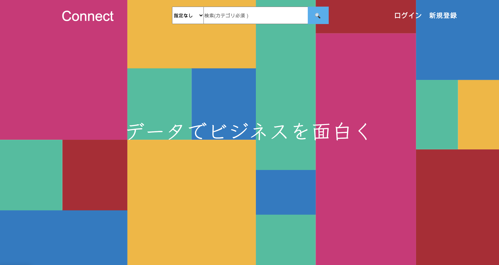
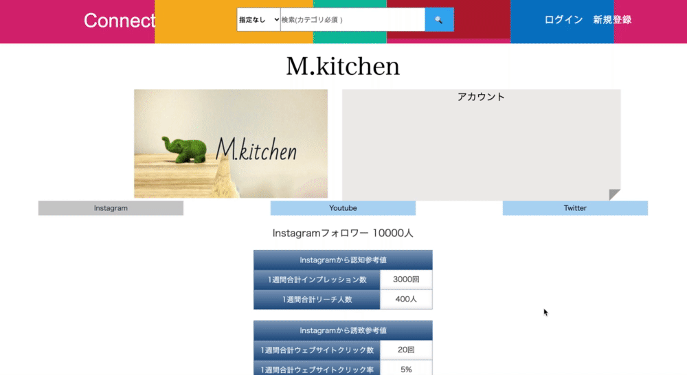
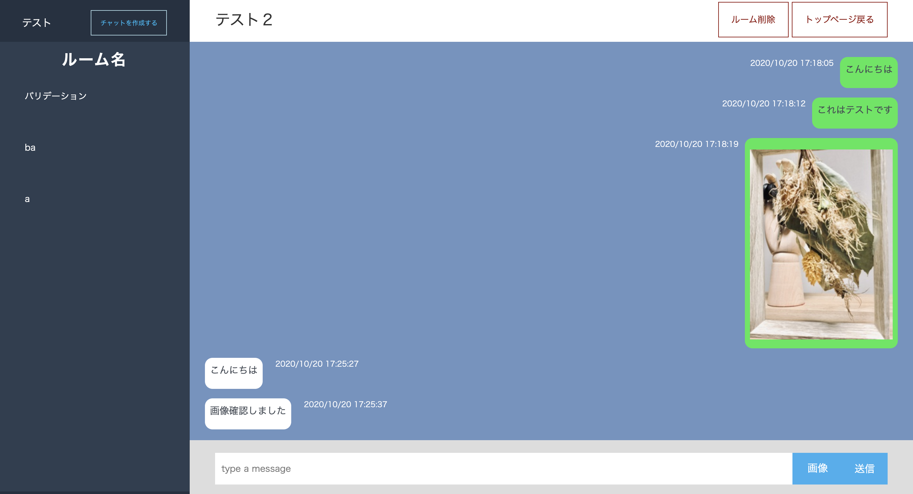
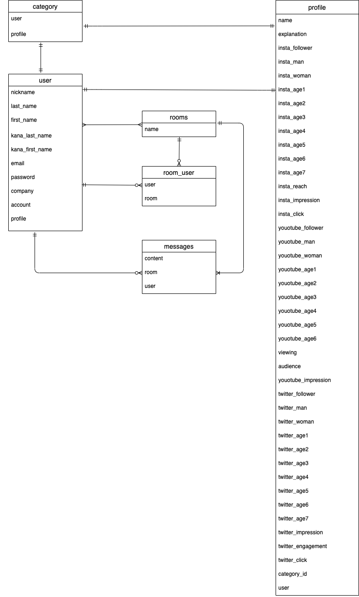

# README
  
  
# CONNECT
 

# 概要  
[CONNECT]　(https://54.238.30.16/) 
https://connect-29747.herokuapp.com/
企業とインフルエンサーを繋げるプラットフォームです。  
・企業がweb広告を用いる際の、費用対効果の高いインフルエンサーを閲覧・検索  
・インフルエンサーの広告指標の登録・公開  

# 使用技術・言語  
-  フロントエンド(javascript,jQuery,HTML/CSS)  
-  バックエンド(Ruby on Rails6.0)  
-  テスト(RSpec,FactoryBot,Capybara)  
-  データベース(MySQL)  
-  Webサーバ(nginx,unicorn)  
-  AWS(EC2,S3)  
-  開発環境(MacOS,VScode,Git,GitHub)
- テストアカウント  
  ID:test1@mail.com  
  PASS:test1111  
  チャット確認用テストコード  
  ID:test2@mail.com  
  PASS:test1111  
  
# 機能要件
## ユーザー管理  
- ユーザー認証機能
- ユーザー情報登録・編集・削除  

## ユーザー間でのチャット  
- メッセージ送信機能  
- メッセージ一覧機能  
- トークルーム作成機能  

## 検索  
- ユーザー検索機能  
- 条件検索：カテゴリー　＋　キーワード  

## UI
- グローバルメニュー（ハンバーガーメニュー）  
- グラフ表示  
  
  
# 非機能要件  
- レスポンシブ対応  
- エラーハンドリング  
- 単体テスト  
- 結合テスト
    
# DEMO   
  
  
## 詳細ページ  
    

## チャット機能  
    
  
  
# 作成物  
【結論】  
企業の広告費用対効果最大化とインフルエンサーの業務獲得率向上 

【背景】  
web広告が増えていく現代において広告を個人に依頼する機会が増えました。  
しかし、依頼する企業側と受ける側のインフルエンサーとの間で課題があります。  
企業側：インフルエンサーに依頼するにしても誰に依頼するのが効果的か不明。  
インフルエンサー側：業務案件の獲得の方法がわからない。  
この双方の課題を解決することを目的としました。 

【詳細】  
インフルエンサーは各SNSで自身のアカウント特徴がわかります。  
その中で着目した内容がフォロワーの男女と年代構成比、コンテンツに対するアクション  
上記の内容からアプローチしたいターゲット層を持っているかつコンテンツに対するアクション率が高いインフルエンサーだと効果が高いと考えられます。  
そのためフォロワーとアクション率から反響がどの程度あるかを明確に計算することが可能です。  

# ER図  
 
  
# テーブル設計

## users テーブル

| Column          | Type       | Options                        |
| ----------------| ---------  | ------------------------------ |
| nickname        | string     | null: false                    |
| last_name       | string     | null: false                    |
| first_name      | string     | null: false                    |
| kana_last_name  | string     | null: false                    |
| kana_first_name | string     | null: false                    |
| email           | string     | null: false                    |
| password        | string     | null: false                    |
| company         | string     |                                |
| account         | string     |                                |
| profile         | references | null: false, foreign_key: true |

### Association

- has_one :profile
- has_one :category
- has_many :room_users
- has_many :rooms, through: room_users
- has_many :messages

## profile テーブル

| Column                   | Type       | Options                        |
| -------------------------| ---------- | ------------------------------ |
| name                     | string     | null: false                    |
| explanation              | text       | null: false                    |
| insta_follower           | integer    | null: false                    |
| insta_man                | integer    | null: false                    |
| insta_woman              | integer    | null: false                    |
| insta_age1               | integer    | null: false                    |
| insta_age2               | integer    | null: false                    |
| insta_age3               | integer    | null: false                    |
| insta_age4               | integer    | null: false                    |
| insta_age5               | integer    | null: false                    |
| insta_age6               | integer    | null: false                    |
| insta_age7               | integer    | null: false                    |
| insta_reach              | integer    | null: false                    |
| insta_impression         | integer    | null: false                    |
| insta_click              | integer    | null: false                    |
| youtube_follower         | integer    |                                |
| youtube_man              | integer    |                                |
| youtube_woman            | integer    |                                |
| youtube_age1             | integer    |                                |
| youtube_age2             | integer    |                                |
| youtube_age3             | integer    |                                |
| youtube_age4             | integer    |                                |
| youtube_age5             | integer    |                                |
| youtube_age6             | integer    |                                |
| youtube_age7             | integer    |                                |
| viewing                  | integer    |                                |
| audience                 | integer    |                                |
| youtube_impression       | integer    |                                |
| twitter_follower         | integer    |                                |
| twitter_man              | integer    |                                |
| twitter_woman            | integer    |                                |
| twitter_age1             | integer    |                                |
| twitter_age2             | integer    |                                |
| twitter_age3             | integer    |                                |
| twitter_age4             | integer    |                                |
| twitter_age5             | integer    |                                |
| twitter_age6             | integer    |                                |
| twitter_age7             | integer    |                                |
| twitter_impression       | integer    |                                |
| twitter_engagement       | integer    |                                |
| twitter_click            | integer    |                                |
| category_id              | integer    | null: false                    |
| user                     | references | null: false, foreign_key: true |

### Association

- belongs_to :user
- has_one :category

## category テーブル

| Column  | Type       | Options                        |
| ------- | ---------- | ------------------------------ |
| user    | references | null: false, foreign_key: true |
| profile | references | null: false, foreign_key: true |

### Association

- belongs_to :profile
- belongs_to :user

## rooms テーブル

| Column  | Type   | Options     |
| ------- | ------ | ----------- |
| name    | string | null: false |

### Association

- has_many :room_user
- has_many :users, through: room_users
- has_many :messages

## room_user テーブル

| Column  | Type       | Options                        |
| ------- | ---------- | ------------------------------ |
| user    | references | null: false, foreign_key: true |
| room    | references | null: false, foreign_key: true |

### Association

- belongs_to :room
- belongs_to :user

## messages テーブル

| Column  | Type       | Options                        |
| ------- | ---------- | ------------------------------ |
| content | string     | null: false, foreign_key: true |
| room    | references | null: false, foreign_key: true |
| user    | references | null: false, foreign_key: true |

### Association

- belongs_to :room
- belongs_to :user

This README would normally document whatever steps are necessary to get the
application up and running.

Things you may want to cover:

* Ruby version

* System dependencies

* Configuration

* Database creation

* Database initialization

* How to run the test suite

* Services (job queues, cache servers, search engines, etc.)

* Deployment instructions

* ...
* ..
* ..
